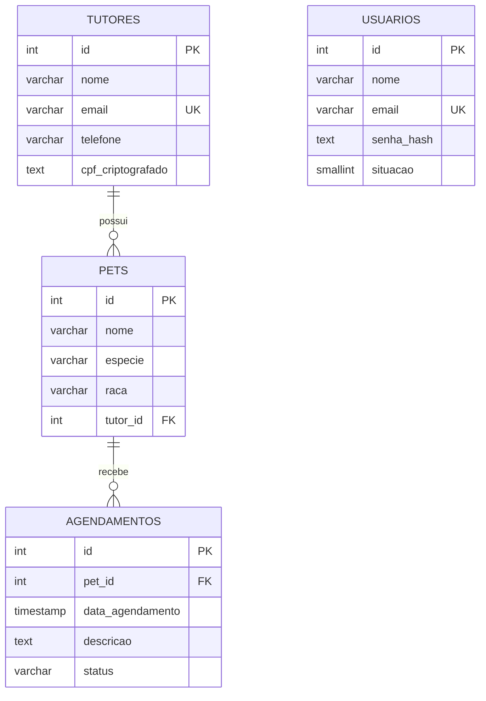

# DER — Clínica Veterinária

```mermaid
erDiagram
  TUTORES ||--o{ PETS : possui
  PETS ||--o{ AGENDAMENTOS : recebe
  USUARIOS {
    int id PK
    varchar nome
    varchar email UK
    text senha_hash
    smallint situacao
  }
  TUTORES {
    int id PK
    varchar nome
    varchar email UK
    varchar telefone
    text cpf_criptografado
  }
  PETS {
    int id PK
    varchar nome
    varchar especie
    varchar raca
    int tutor_id FK
  }
  AGENDAMENTOS {
    int id PK
    int pet_id FK
    timestamp data_agendamento
    text descricao
    varchar status
  }
```

Usuários autenticam no sistema; CPF é armazenado cifrado em base64 com AES-256-GCM. Tutores têm muitos pets; pets têm muitos agendamentos.
